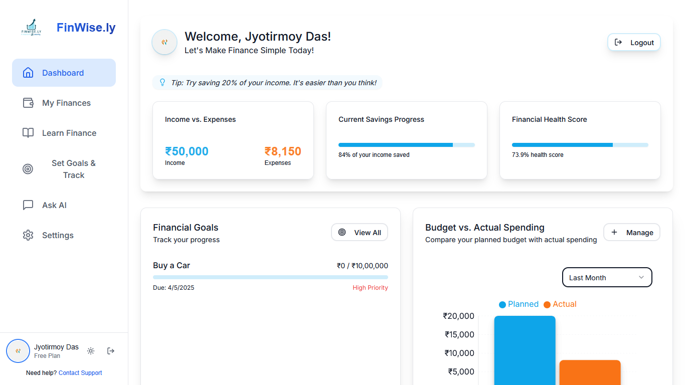

# FinWise.ly - Your Personal Finance Management Platform 

FinWise.ly is a modern, AI-powered personal finance management platform that helps users track their expenses, set financial goals, and learn about personal finance through interactive content and AI assistance.

## ✅ Project Status: Completed 

All planned features have been successfully implemented and the application is ready for use!

## Screenshots

### Dashboard View

*The main dashboard provides an overview of financial health, recent transactions, and goal progress*

### Key Features Showcase
| Feature | Description |
|---------|-------------|
| Financial Overview | Track income, expenses, and savings at a glance |
| Goal Tracking | Visual progress bars for financial goals |
| AI Assistant | Get personalized financial advice through natural language |
| Learning Hub | Access curated financial education resources |

## Features

- 📊 Dashboard for financial overview
- 💰 Expense tracking and management
- 🎯 Goal setting and progress tracking
- 📚 Interactive financial learning resources
- 🤖 AI-powered financial advice and assistance
- 🌓 Dark/Light mode support
- 🔒 Secure authentication
- 📱 Responsive design

## Tech Stack

### Frontend
- **Framework**: Next.js 15   
- **Language**: TypeScript  
- **Styling**: Tailwind CSS with custom theming  
- **UI Components**: 
  - Shadcn UI (component library) 
  - Radix UI (for accessible components) 
  - Lucide React (for icons) 
  - Framer Motion (for animations) 
  - Sonner (for toast notifications) 
- **State Management**: React Hooks
- **Charts**: Recharts for financial visualizations 
- **Markdown Support**: React Markdown with Remark GFM
- **Code Highlighting**: Shiki

### Backend
- **Framework**: Next.js API Routes 
- **Database**: Firebase Firestore 
- **Authentication**: NextAuth.js with Firebase 
- **AI Integration**: Google Generative AI (Gemini) 
- **File Storage**: Firebase Storage 
- **Security**: Firebase Rules

### APIs Used
- **Google Generative AI (Gemini)**: For financial advice and conversational assistance
- **Firebase Authentication**: For user management and security
- **Firebase Firestore**: For storing user data, transactions, and goals
- **Firebase Storage**: For storing user documents and images
- **NextAuth.js**: For authentication flow management
- **YouTube Data API**: For fetching financial education videos in the learning section

## Prerequisites

Before you begin, ensure you have the following installed:
- Node.js (v18 or higher) 
- npm or yarn 
- Git

## Detailed Setup Instructions

### 1. Clone the Repository

```bash
git clone https://github.com/JyotirmoyDas05/finwise.ly.git
cd finwise-ly
```

### 2. Install Dependencies

```bash
npm install
# or
yarn install
```

### 3. Setting Up Firebase

1. Go to the [Firebase Console](https://console.firebase.google.com/)
2. Click on "Add project" and create a new project
3. Once your project is created, click on "Web" to add a web app to your project
4. Register your app with a nickname and click "Register app"
5. Copy the Firebase configuration values for the next step

#### Setting Up Firebase Authentication

1. In the Firebase Console, go to "Authentication" in the left sidebar
2. Click on "Get Started"
3. Enable the "Email/Password" and "Google" providers
4. For Google provider, configure the OAuth consent screen as prompted

#### Setting Up Firebase Firestore

1. In the Firebase Console, go to "Firestore Database" in the left sidebar
2. Click on "Create database"
3. Start in production mode and choose a location closest to your users
4. Set up the following collections:
   - `users`: To store user profiles
   - `transactions`: To store financial transactions
   - `goals`: To store financial goals
   - `learn`: To store learning resources

#### Setting Up Firebase Storage

1. In the Firebase Console, go to "Storage" in the left sidebar
2. Click on "Get Started"
3. Select the default rules and click "Next"
4. Choose a location closest to your users

### 4. Setting Up Google AI API

1. Go to the [Google AI Studio](https://makersuite.google.com/)
2. Create an account or sign in with your Google account
3. Navigate to "API Keys" or "Get API Key"
4. Create a new API key and make sure it has access to the Gemini model
5. Copy the API key for the next step

### 5. Setting Up YouTube Data API

1. Go to the [Google Cloud Console](https://console.cloud.google.com/)
2. Create a new project or select an existing one
3. Navigate to "APIs & Services" > "Library"
4. Search for "YouTube Data API v3" and click on it
5. Click "Enable" to activate the API for your project
6. After enabling, go to "APIs & Services" > "Credentials"
7. Click "Create Credentials" and select "API key"
8. Copy the generated API key for the next step
9. (Optional but recommended) Restrict the API key to only be used with YouTube Data API

### 6. Environment Variables

Create a `.env.local` file in the root directory with the variables from the provided `.env.example` file:

```env
# Firebase Configuration
NEXT_PUBLIC_FIREBASE_API_KEY=your_firebase_api_key
NEXT_PUBLIC_FIREBASE_AUTH_DOMAIN=your_firebase_auth_domain
NEXT_PUBLIC_FIREBASE_PROJECT_ID=your_firebase_project_id
NEXT_PUBLIC_FIREBASE_STORAGE_BUCKET=your_firebase_storage_bucket
NEXT_PUBLIC_FIREBASE_MESSAGING_SENDER_ID=your_firebase_messaging_sender_id
NEXT_PUBLIC_FIREBASE_APP_ID=your_firebase_app_id

# Google AI API
GOOGLE_AI_API_KEY=your_google_ai_api_key

# YouTube Data API
YOUTUBE_API_KEY=your_youtube_api_key

# NextAuth Configuration
NEXTAUTH_SECRET=any_random_string_for_security
NEXTAUTH_URL=http://localhost:3000
```

Replace all placeholders with your actual values from the previous setup steps.

For beginners: An `.env.example` file is included in the repository to use as a template. You can copy this file and rename it to `.env.local`, then fill in your own API keys and credentials.

### 7. Run the Development Server

```bash
npm run dev
# or
yarn dev
```

### 8. Access the Application

Open [http://localhost:3000](http://localhost:3000) in your browser.

## Building for Production

To create a production build:

```bash
npm run build
# or
yarn build
```

To start the production server:

```bash
npm start
# or
yarn start
```

## Project Structure

```
finwise-ly/
├── src/
│   ├── app/              # Next.js app directory with all routes
│   │   ├── api/          # API routes
│   │   ├── auth/         # Authentication pages
│   │   ├── finances/     # Finance management pages
│   │   ├── goals/        # Goal tracking pages
│   │   ├── learn/        # Learning resources pages
│   │   ├── ask/          # AI assistant pages
│   │   └── settings/     # User settings pages
│   ├── components/       # Reusable UI components
│   │   ├── ui/           # Basic UI components
│   │   ├── charts/       # Chart components
│   │   └── forms/        # Form components
│   ├── lib/              # Utility functions and configurations
│   │   ├── firebase/     # Firebase configuration
│   │   ├── auth/         # Authentication utilities
│   │   └── ai/           # AI integration utilities
│   └── styles/           # Global styles
├── public/               # Static assets
│   └── DashBoard.png     # Dashboard screenshot
├── .env.local            # Environment variables
└── package.json          # Project dependencies
```

## Key Features Implementation

### Dashboard
The dashboard provides a comprehensive overview of your financial health, including expense tracking, income monitoring, and goal progress.

### Expense Tracking
Users can add, categorize, and analyze expenses. The system automatically categorizes expenses and provides insights on spending patterns.

### Goal Setting
Set financial goals with target amounts and dates. The system provides progress tracking and suggestions to help achieve goals faster.

### Learning Resources
Access a library of financial education resources, from basic concepts to advanced investment strategies.

### AI Assistant
The AI-powered assistant can answer financial questions, provide personalized advice, and help with budgeting decisions.

## Contributing

1. Fork the repository
2. Create your feature branch (`git checkout -b feature/AmazingFeature`)
3. Commit your changes (`git commit -m 'Add some AmazingFeature'`)
4. Push to the branch (`git push origin feature/AmazingFeature`)
5. Open a Pull Request

## License

This project is licensed under the MIT License - see the [LICENSE](LICENSE) file for details. 

## Support

For support, email jyotimoydascse@gmail.com or join our Discord Channel(To be Given soon). 

## Acknowledgments

- Next.js team for the amazing framework
- Firebase team for the backend services
- Google AI team for the generative AI capabilities
- All contributors who have helped shape this project

---

<div align="center">
  
  
  
  
  
  
  <p>Made with ❤️ by Team CodeProwlers</p>
</div>
